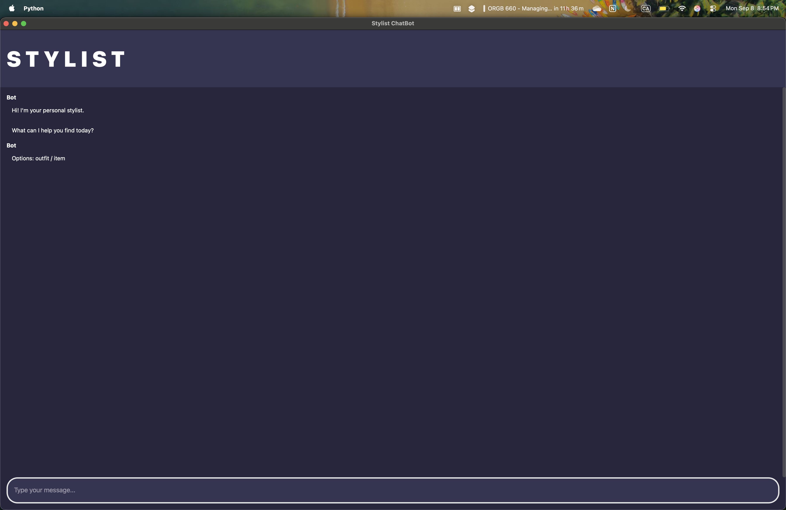
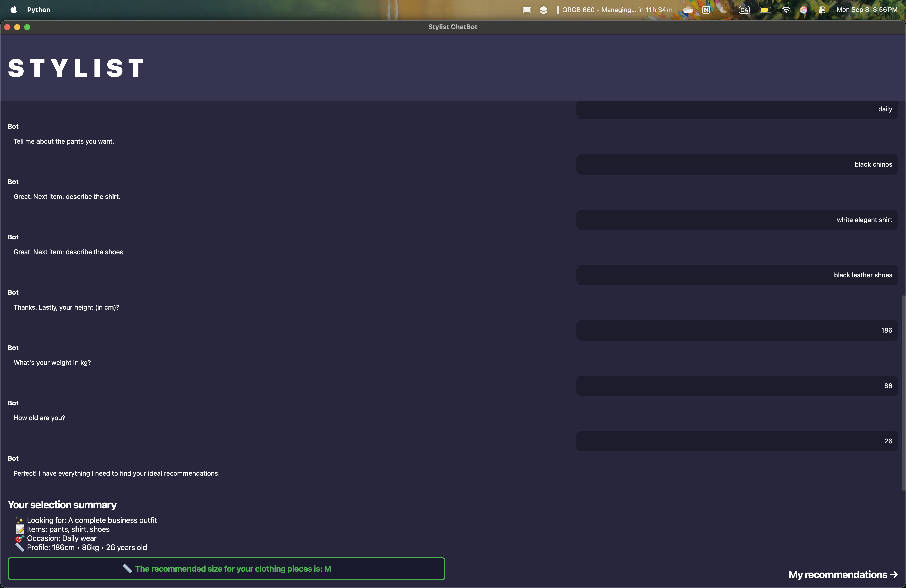
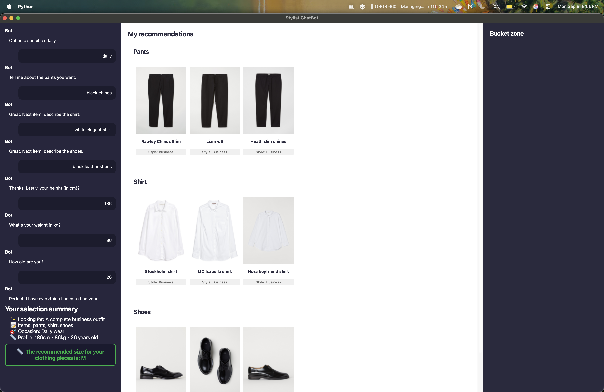

# Retail Chatbot - AI-Powered Fashion Stylist

An intelligent conversational retail chatbot that acts as your personal stylist, collecting user preferences through natural dialogue and providing personalized clothing recommendations using advanced embedding-based similarity matching.

## Screenshots
<div align="center">

### Initial Conversation Interface


*The chatbot guides users through preference collection with a clean, conversational interface featuring the prominent STYLIST branding and intuitive chat bubbles.*

<br><br>

### Preference Summary & Size Recommendation


*Split-screen view showing the complete conversation history alongside a detailed preference summary, personalized size recommendations, and the transition to browsing recommendations.*

<br><br>

### Complete Recommendation Display


*Final three-panel layout showing chat history (left), categorized product recommendations (center), and bucket zone (right) with real product images organized by clothing type.*

</div>


## Features

### **Conversational AI Interface**
- Natural language conversation flow for preference collection
- Intelligent validation of user inputs with fashion-domain awareness
- Context-aware responses that guide users through the styling process

### **Multiple Styling Modes**
- **Complete Outfit**: Curate coordinated multi-piece outfits
- **Single Item**: Find specific clothing pieces
- **Wardrobe Matching**: Recommend items that complement existing wardrobe

### **Smart Recommendation Engine**
- **Embedding-based similarity matching** using sentence transformers
- **Multi-factor scoring**: Style, color, and semantic description matching
- **Personalized size recommendations** based on body measurements
- **Context-aware filtering** by occasion and style preferences

### **Rich Visual Experience**
- Product images organized by category (shirts, pants, shoes, etc.)
- Horizontal scrolling galleries with product details
- Responsive three-panel layout: Chat (20%) + Recommendations (60%) + Bucket (20%)
- Auto-hiding scrollbars for clean interface design

## Quick Start

### Prerequisites
- Python 3.10-3.11 (recommended for stability)
- ~30GB disk space for product images (optional)

### Installation

1. **Clone the repository**
   ```bash
   git clone https://github.com/rafachan3/retail-chatbot
   cd retail-chatbot
   ```

2. **Set up virtual environment**
   ```bash
   python -m venv venv
   source venv/bin/activate  # On Windows: venv\Scripts\activate
   pip install -r requirements.txt
   ```

3. **Download product images** (Optional but recommended)
   ```bash
   # Download from Kaggle H&M dataset (~30GB)
   # https://www.kaggle.com/competitions/h-and-m-personalized-fashion-recommendations/data?select=images
   # Place the images folder in: retail-chatbot/recommendation/
   ```

4. **Organize image files**
   ```bash
   python images_folder.py  # Flattens subfolder structure
   ```

5. **Launch the application**
   ```bash
   python main.py
   ```

> **Note**: If you skip the image download, placeholder images will be displayed for recommendations.

## How to Use

### Step 1: Conversation Phase
The chatbot guides you through a structured conversation to understand your needs:

- **Mode Selection**: Choose between complete outfit or single item
- **Style Preferences**: Describe your desired aesthetic (casual, business, minimal, etc.)
- **Specific Requirements**: 
  - For outfits: List items needed, specify occasion
  - For single items: Describe the piece, choose wardrobe matching
- **Body Measurements**: Height, weight, and age for size recommendations

### Step 2: Summary & Review
- Review your collected preferences in a clean summary view
- Get personalized size recommendations based on your measurements
- Proceed to see your curated recommendations

### Step 3: Browse Recommendations
- Explore products organized by category in scrollable galleries
- View product images, names, and style information
- Use the bucket zone for saving favorite items

## Architecture

### Frontend (PyQt6)
- **`app.py`**: Main GUI application with responsive chat interface
- **`main.py`**: Application entry point with Qt configuration
- Custom widgets for chat bubbles, image galleries, and auto-hiding scrollbars

### Backend Systems

#### Conversation Engine
- **`user-preferences/backend-user-preferences.py`**: Finite state machine for dialogue flow
- Natural language processing with NLTK for input validation
- Fashion-domain vocabulary for intelligent parsing

#### Recommendation Engine  
- **`recommendation/backend_recs.py`**: Embedding-based recommendation system
- Sentence transformers for semantic similarity matching
- Multi-factor scoring combining style, color, and description matches

### Key Technologies
- **PyQt6**: Modern cross-platform GUI framework
- **Sentence Transformers**: State-of-the-art embedding models
- **NLTK**: Natural language processing for text validation
- **Pandas & NumPy**: Data processing and numerical computations
- **Pillow**: Image processing and display

## Configuration

### Environment Variables
```bash
# Enable debug mode for cleaned text fields
export RETAIL_CHATBOT_DEBUG_CLEAN=1
```

### Logging
- Application logs are written to `user-preferences/session.log`
- INFO level logging shows conversation flow and recommendation generation
- Adjust logging level in `main.py` if needed

## Data Pipeline

### Input Processing
1. **Text Normalization**: Lowercase, whitespace cleanup, stop word removal
2. **Fashion Validation**: Domain-specific vocabulary checking
3. **Preference Extraction**: Structured data collection from natural language

### Recommendation Generation
1. **Embedding Computation**: Convert preferences to high-dimensional vectors
2. **Similarity Scoring**: Match user preferences against product database
3. **Multi-factor Ranking**: Combine style, color, and semantic similarity scores
4. **Category Grouping**: Organize results by clothing type for presentation

## UI Design Principles

### Conversational Flow
- **Progressive disclosure**: Information gathered step-by-step
- **Natural validation**: Fashion-aware input checking
- **Contextual guidance**: Helpful examples and suggestions

### Visual Hierarchy
- **Brand prominence**: Large STYLIST header for brand recognition
- **Chat-first design**: Conversation takes center stage initially
- **Seamless transitions**: Smooth flow from chat to recommendations

### Responsive Experience
- **Adaptive input**: Auto-expanding text areas
- **Smart scrolling**: Auto-hide scrollbars with hover activation
- **Category organization**: Logical grouping of recommendation results

## Development

### Adding New Features
1. **Conversation Flow**: Extend the FSM in `backend-user-preferences.py`
2. **Recommendation Logic**: Modify scoring algorithms in `backend_recs.py`
3. **UI Components**: Add custom widgets in `app.py`

### Debugging
- Enable clean text debugging: `session.enable_clean_debug(True)`
- Check `session.log` for conversation flow analysis
- Use INFO logging level for recommendation pipeline insights

## File Structure

```
retail-chatbot/
├── assets/
│   ├── image1-conversation.png     # UI screenshot - conversation phase
│   ├── image2-summary.png          # UI screenshot - summary phase
│   └── image3-recommendations.png  # UI screenshot - recommendations view
├── recommendation/                 # Recommendation engine module
├── user-preferences/               # Conversation engine module
├── .gitignore                     # Git ignore rules
├── 0005720_coming-soon-page_550.jpeg # Placeholder image for products
├── app.py                         # Main GUI application
├── images_folder.py              # Image organization utility
├── LICENSE                        # Project license
├── main.py                       # Application entry point
├── README.md                     # This documentation file
└── requirements.txt              # Python dependencies
```

## Contributing

1. Fork the repository
2. Create a feature branch (`git checkout -b feature/amazing-feature`)
3. Commit your changes (`git commit -m 'Add amazing feature'`)
4. Push to the branch (`git push origin feature/amazing-feature`)
5. Open a Pull Request

## License
This project is licensed under the [MIT License](./LICENSE).


## Acknowledgments

- **H&M**: Product images from the H&M Personalized Fashion Recommendations dataset
- **SentenceTransformers**: Powering the semantic similarity matching
- **PyQt6**: Enabling the rich desktop interface experience